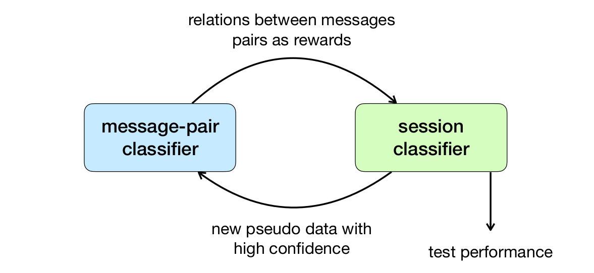

# Unsupervised-dialo-disentanglement

This respository contains the source code of the paper [Unsupervised Conversation Disentanglement through Co-Training]() which is published in EMNLP 2021. In this work, we explore training a conversation disentanglement model without referencing any human annotations. Our method is built upon the deep co-training algorithm. Experimental results on the large Movie Dialogue Dataset demonstrate that our proposed approach achieves competitive performance compared to previous supervised methods.

